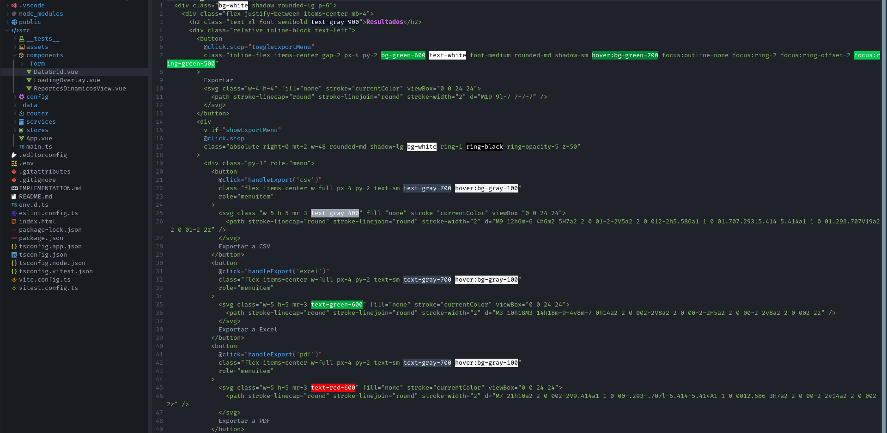

# Neovim Configuration



Modern Neovim setup for full-stack development with LSP, autocompletion, and Git integration.

## Structure

```
~/.config/nvim/
├── init.lua                 # Entry point
├── lua/
│   ├── config/
│   │   ├── options.lua      # Editor settings
│   │   └── keymaps.lua      # Key bindings
│   ├── plugins/
│   │   ├── completion.lua   # nvim-cmp + LuaSnip
│   │   ├── diagnostics.lua  # Error display (Trouble)
│   │   ├── editor.lua       # Telescope + Treesitter
│   │   ├── git.lua          # Gitsigns
│   │   ├── lsp.lua          # Language servers (Mason)
│   │   └── ui.lua           # Theme + Neo-tree
│   └── utils/
│       └── icons.lua        # Folder icon dictionary
└── lazy-lock.json           # Plugin versions
```

## Features

- **LSP**: TypeScript, Vue, HTML, CSS, JSON, Tailwind, Python, Java
- **Autocompletion**: Context-aware with icons
- **Syntax**: Treesitter highlighting
- **File Explorer**: Neo-tree with custom folder colors
- **Fuzzy Finder**: Telescope
- **Git Integration**: Inline blame + change indicators
- **Diagnostics**: Inline errors with Trouble panel

## Requirements

- Neovim ≥ 0.10
- Git
- Node.js (for LSP servers)
- A Nerd Font (see [Font Setup](#font-setup))

## Installation

```bash
# Backup existing config
mv ~/.config/nvim ~/.config/nvim.backup

# Clone this config
git clone https://github.com/JuansesDev/dotfiles-nvim.git ~/.config/nvim

# Start Neovim (plugins auto-install)
nvim
```

## Font Setup

The icons used in Neo-tree, the completion menu, and diagnostics come from a [Nerd Font](https://www.nerdfonts.com/). Without one installed and active in your terminal, you'll see empty boxes instead of icons.

### Install on Arch Linux

```bash
sudo pacman -S ttf-firacode-nerd
```

Other good options: `ttf-jetbrains-mono-nerd`, `ttf-cascadia-code-nerd`.

### Install on Debian/Ubuntu

```bash
mkdir -p ~/.local/share/fonts
cd ~/.local/share/fonts
curl -fLO https://github.com/ryanoasis/nerd-fonts/releases/latest/download/FiraCode.zip
unzip FiraCode.zip && rm FiraCode.zip
fc-cache -fv
```

### Configure your terminal

Set the terminal's font to the Nerd Font variant you installed.

**Konsole:**
1. `Settings` → `Edit Current Profile…` → `Appearance`
2. Click `Select Font…`
3. Choose `FiraCode Nerd Font` (not `FiraCode Nerd Font Mono`)
4. Restart Konsole

**Verify the font is registered:**

```bash
fc-list | grep -i "nerd"
```

## Key Bindings

| Key | Action |
|-----|--------|
| `<leader>e` | Toggle file explorer |
| `<leader>ff` | Find files |
| `<leader>fg` | Search text |
| `<leader>xx` | Show diagnostics |
| `<leader>gp` | Preview git hunk |
| `<leader>gb` | Toggle git blame |
| `<leader>w` | Save file |
| `<leader>q` | Quit |
| `<Esc>` | Clear search highlight |
| `<C-h/j/k/l>` | Navigate splits |

**Leader key**: `Space`

## Customization

Edit files in `lua/config/` for general settings, or `lua/plugins/` for plugin-specific config. Folder-name to icon/highlight mappings live in `lua/utils/icons.lua`.
