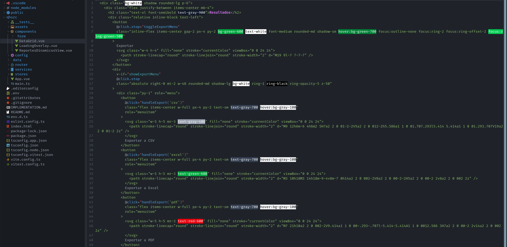

# Neovim Configuration



Modern Neovim setup for full-stack development with LSP, autocompletion, debugging and Git integration. Works on **macOS**, **Linux** and **WSL**.

## Structure

```
~/.config/nvim/
├── init.lua                 # Entry point
├── lua/
│   ├── config/
│   │   ├── options.lua      # Editor settings
│   │   ├── clipboard.lua    # Portapapeles cross-platform (macOS/Linux/WSL/SSH)
│   │   ├── keymaps.lua      # Key bindings
│   │   ├── cheatsheet.lua   # :Cheatsheet / :Atajos
│   │   └── find.lua         # :Fin  — fuzzy find nativo
│   └── plugins/
│       ├── completion.lua   # nvim-cmp + LuaSnip
│       ├── dap.lua          # Debugger (nvim-dap + codelldb/js-debug/debugpy)
│       ├── diagnostics.lua  # Error display (Trouble)
│       ├── editor.lua       # Telescope + Oil + Treesitter
│       ├── flutter.lua      # Flutter / Dart
│       ├── git.lua          # Gitsigns
│       ├── lsp.lua          # Language servers (Mason)
│       ├── rust.lua         # rustaceanvim + crates.nvim
│       └── ui.lua           # Theme (monochrome)
└── lazy-lock.json           # Plugin versions
```

## Features

- **Theme**: `monochrome.nvim` with transparency and a custom green tint on keywords
- **LSP**: TypeScript, Vue, HTML, CSS, JSON, Tailwind, Python
- **Autocompletion**: nvim-cmp + LuaSnip, with icons
- **Syntax**: Treesitter (rama `main`) — JS/TS/TSX, Vue, HTML, CSS, JSON, Lua, Python, Rust, Dart, Go, YAML, Markdown, Bash
- **File Explorer**: Oil (editable buffer, not a tree)
- **Fuzzy Finder**: Telescope, plus a native `:Fin` fallback with no plugin
- **Debugger**: nvim-dap + dap-ui, con adapters para Node, Chrome, Python, Rust/C/C++ y Go
- **Git Integration**: Gitsigns (change indicators + blame on demand)
- **Diagnostics**: Inline con `virtual_lines` + panel de Trouble
- **Cheatsheet**: `:Cheatsheet` abre una guía de atajos dentro de Neovim

## Requirements

- **Neovim ≥ 0.11** (ver [Instalar Neovim](#instalar-neovim-moderno))
- Git
- Node.js (para la mayoria de LSP servers)
- A Nerd Font (see [Font Setup](#font-setup))

Opcionales, solo si usas esa parte:

- `fd` o `rg` — hacen que `:Fin` y Telescope vuelen
- Flutter SDK — para `lua/plugins/flutter.lua`
- Rust toolchain (`rustc`, `cargo`) — para `lua/plugins/rust.lua`
- Go — para `nvim-dap-go`

## Installation

```bash
# Backup existing config
mv ~/.config/nvim ~/.config/nvim.backup

# Clone this config
git clone https://github.com/JuansesDev/dotfiles-nvim.git ~/.config/nvim

# Start Neovim (plugins auto-install)
nvim
```

Then run `:Mason` to check the language servers and `:checkhealth` if something looks off.

### Instalar Neovim moderno

Esta config usa `vim.lsp.config()`, `vim.o.findfunc` y `vim.lsp.document_color`, que **necesitan Neovim 0.11 o superior**. El `neovim` de los repos de Debian/Ubuntu suele ser 0.9 o 0.10 y media config falla, asi que instala el binario oficial:

```bash
# Linux x86_64
curl -fLO https://github.com/neovim/neovim/releases/latest/download/nvim-linux-x86_64.tar.gz
sudo rm -rf /opt/nvim
sudo tar -C /opt -xzf nvim-linux-x86_64.tar.gz
echo 'export PATH="$PATH:/opt/nvim-linux-x86_64/bin"' >> ~/.bashrc
```

En macOS: `brew install neovim`.

### Notas para WSL

- El portapapeles lo maneja `lua/config/clipboard.lua`. Con WSLg funciona solo; sin WSLg instala `win32yank` para que `y`/`p` hablen con el portapapeles de Windows:
  ```bash
  curl -fLO https://github.com/equalsraf/win32yank/releases/latest/download/win32yank-x64.zip
  unzip win32yank-x64.zip -d /tmp && sudo install -m 755 /tmp/win32yank.exe /usr/local/bin/
  ```
  Si no esta, la config cae automaticamente a OSC52 (Windows Terminal lo soporta).
- Los binarios que instala Mason (LSP, DAP) son por sistema operativo. Al clonar la config en otra maquina, `:Mason` los reinstala sola — no los copies a mano.

## Font Setup

The icons used in the completion menu, diagnostics and statusline come from a [Nerd Font](https://www.nerdfonts.com/). Without one installed and active in your terminal, you'll see empty boxes instead of icons.

### Install on macOS

```bash
brew install --cask font-fira-code-nerd-font
```

### Install on Arch Linux

```bash
sudo pacman -S ttf-firacode-nerd
```

Other good options: `ttf-jetbrains-mono-nerd`, `ttf-cascadia-code-nerd`.

### Install on Debian/Ubuntu

```bash
mkdir -p ~/.local/share/fonts
cd ~/.local/share/fonts
curl -fLO https://github.com/ryanoasis/nerd-fonts/releases/latest/download/FiraCode.zip
unzip FiraCode.zip && rm FiraCode.zip
fc-cache -fv
```

### Configure your terminal

Set the terminal's font to the Nerd Font variant you installed.

- **macOS**: iTerm2 → `Settings` → `Profiles` → `Text` → `Font`. En Terminal.app no se puede cambiar a una fuente Nerd Font sin parchear el sistema; usa iTerm2, kitty o WezTerm.
- **Windows Terminal + WSL**: `Settings` → tu perfil de Ubuntu → `Appearance` → `Font face` → `FiraCode Nerd Font`.
- **Konsole**: `Settings` → `Edit Current Profile…` → `Appearance` → `Select Font…` → `FiraCode Nerd Font` (not `FiraCode Nerd Font Mono`).

**Verify the font is registered:**

```bash
fc-list | grep -i "nerd"
```

## Key Bindings

| Key | Action |
|-----|--------|
| `<leader>w` | Save file |
| `<leader>q` | Quit |
| `<leader>e` / `-` | Open Oil (file explorer) |
| `<leader>ff` | Find files (Telescope) |
| `<leader>fg` | Live grep |
| `<leader>fb` | Open buffers |
| `<leader>/` | Fuzzy find in current file |
| `:Fin <texto>` | Fuzzy find nativo, abre la mejor coincidencia |
| `<leader>xx` | Show diagnostics (Trouble) |
| `<leader>d` | Diagnostic float for current line |
| `gd` / `gr` / `K` | Definition / References / Hover (LSP) |
| `<leader>rn` / `<leader>ca` | Rename / Code action (LSP) |
| `<leader>gp` / `<leader>gb` | Preview git hunk / Toggle blame |
| `<C-h/j/k/l>` | Navigate splits |
| `<Esc>` | Clear search highlight |
| `<F5>` `<F10>` `<F11>` `<F12>` | DAP continue / over / into / out |
| `<leader>Db` / `<leader>Du` | Toggle breakpoint / Toggle DAP UI |
| `<leader>Fr` / `<leader>Fl` / `<leader>Fq` | Flutter run / hot reload / quit |
| `<leader>Rr` / `<leader>Rd` | Rust runnables / debuggables |
| `:Cheatsheet` | Full cheatsheet (also `:Atajos`) |
| `:Mason` / `:Lazy` | Manage LSP+DAP / plugins |

**Leader key**: `Space`

## Customization

Edit files in `lua/config/` for general settings, or `lua/plugins/` for plugin-specific config.

- El tema y sus colores viven en `lua/plugins/ui.lua`.
- El fuzzy find nativo (`:Fin`) y su cache estan en `lua/config/find.lua`.
- La guia de atajos es una lista de texto en `lua/config/cheatsheet.lua` — agregar una linea ahi la mete en `:Cheatsheet`.
